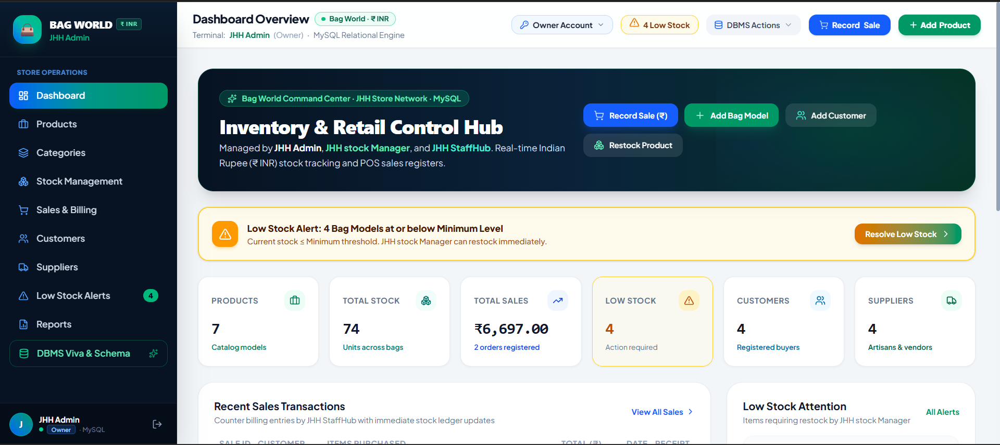
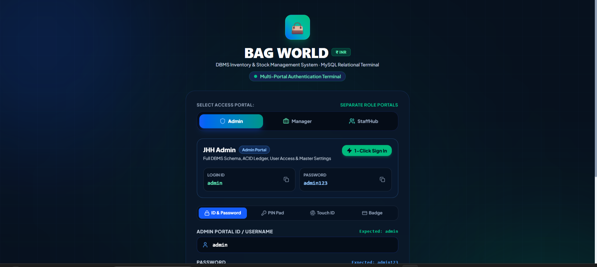

# 👜 Bag Stock Management System

## 📌 About the Project

The **Bag Stock Management System** is a web-based inventory and retail management application designed to manage bag products, stock levels, customers, and sales efficiently.

The system helps store managers monitor inventory, identify low-stock products, record sales, and manage product information through a simple and user-friendly dashboard.

## ✨ Features

- 📦 Product Management
- 📊 Stock Management
- 🛒 Sales Recording
- 👥 Customer Management
- 🔄 Product Restocking
- ⚠️ Low Stock Alerts
- 💰 Sales and Stock Tracking in Indian Rupees (₹)
- 📋 Dashboard Overview
- 🗄️ Database Management

## 🖥️ Dashboard Preview



## 🔐 Login Page



## 🧩 Main Modules

### 1. Product Management
Add and manage bag products, product details, prices, and stock quantities.

### 2. Stock Management
Monitor available stock and identify products that require restocking.

### 3. Sales Management
Record customer purchases and maintain sales information.

### 4. Customer Management
Add and manage customer details.

### 5. Low Stock Alert
Displays alerts when product stock reaches or falls below the minimum stock level.

### 6. Dashboard
Provides an overview of products, total stock, sales, and important inventory information.

## 🛠️ Technologies Used

- HTML
- CSS
- JavaScript
- React
- MySQL
- Google AI Studio
- GitHub

## 🎯 Project Objective

The main objective of this project is to develop an easy-to-use inventory management system for a bag retail business.

It helps reduce manual stock management, monitor product availability, manage sales, and provide quick access to important business information.

## 🚀 Future Enhancements

- User Authentication
- Sales Reports and Analytics
- PDF Invoice Generation
- Supplier Management
- Advanced Inventory Reports
- Online Database Backup
- Improved Sales Analytics

## 📂 Project Structure

```text
bag-stock-management/
│
├── README.md
├── screenshots/
│   └── dashboard.png
├── src/
├── public/
└── package.json
